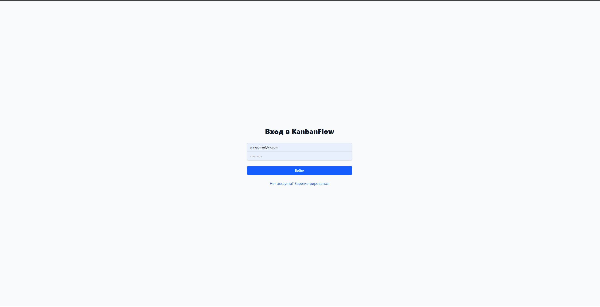
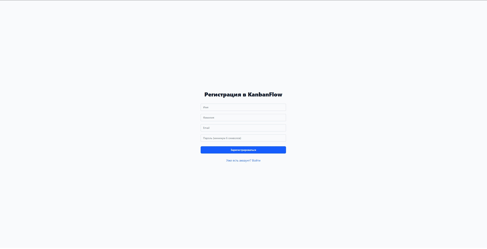
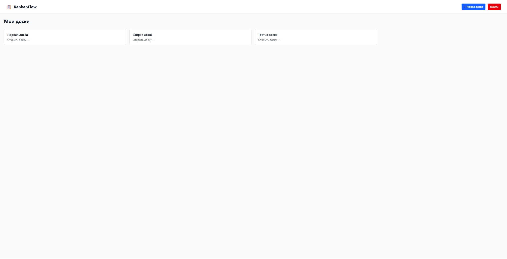
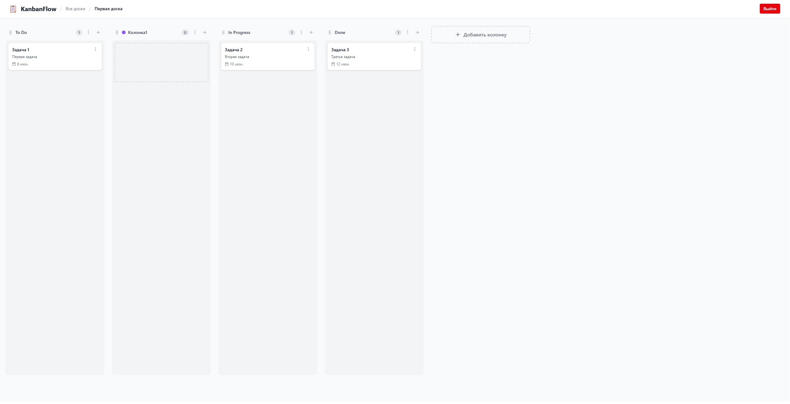

# KanbanFlow

Современное приложение с канбан-доской для управления задачами, созданное с использованием .NET 8 и React.

## 📸 Скриншоты


*Страница авторизации*


*Страница регистрации*


*Главная страница с досками*


*Вид доски с задачами*

## 🚀 Быстрый старт

### С помощью Docker

```bash```

git clone https://github.com/AlRyabinin/Kanban.git

cd KanbanFlow

docker-compose up -d --build

##  Возможности

- 📋 Создание и управление несколькими досками
- 📊 Перетаскивание задач между колонками (drag-and-drop)
- 🎨 Настраиваемые цвета колонок
- ✏️ Полный набор CRUD-операций для досок, колонок и задач
- 🔄 Изменение порядка колонок и задач в реальном времени
- 🐳 Поддержка Docker для простого развертывания

## Безопасность
- 🔐 Регистрация и аутентификация пользователей
- 🔑 JWT-токены для защиты API
- 👤 Изоляция данных по пользователям

## 🛠️ Технологический стек

### Бэкенд
- **.NET 8** с ASP.NET Core
- **Entity Framework Core** с SQLite
- **MediatR** для реализации паттерна CQRS
- **Чистая архитектура** (Domain, Application, Infrastructure, API)

### Фронтенд
- **React 18** с TypeScript
- **TanStack Query** для управления состоянием на стороне сервера
- **dnd-kit** для реализации перетаскивания
- **Tailwind CSS** для стилизации
- **Lucide React** для иконок

### Infrastructure
- **Docker** & **Docker Compose**
- **Nginx** в качестве обратного прокси-сервера
